# Emoji Decode Challenge

A cutting-edge, zero-backend web application that transforms text, images, and audio into emoji puzzles using Chrome's built-in AI. Create challenges from any content and share them for others to decode!

## 🚀 Features

### **🎯 Core Functionality**
- **Multimodal Input**: Text, camera photos, audio recordings, and drag & drop images
- **Chrome AI Integration**: Real on-device AI processing with Gemini Nano
- **Smart Challenge Generation**: Two-step AI processing for meaningful puzzle creation
- **Viral Sharing**: Generate shareable URLs with embedded challenges
- **Interactive Decoding Game**: Progressive clue system with scoring

### **🧠 AI-Powered Features**
- **Image Analysis**: AI describes photos in 2-6 words, then converts to emojis
- **Audio Transcription**: AI transcribes speech and converts to emoji sequences  
- **Intelligent Clues**: Chrome AI generates contextual hints based on attempt number
- **Progressive Difficulty**: Clues become more specific with each wrong answer
- **Fallback Systems**: Graceful degradation when AI is unavailable

### **📱 User Experience**
- **Responsive Design**: Works perfectly on mobile and desktop
- **Camera Integration**: Full-screen webcam capture with live preview
- **Audio Recording**: One-click microphone recording with visual feedback
- **Scoring System**: Points-based gameplay with attempt tracking
- **Social Sharing**: Direct integration with Twitter, Facebook, LinkedIn, WhatsApp
- **Debug Console**: Real-time logging for development and troubleshooting

### **🔧 Technical Features**
- **Zero Backend**: Pure client-side SPA with no server dependencies
- **URL-Based Sharing**: Base64-encoded challenges in shareable URLs
- **Cross-Browser Compatibility**: Graceful fallbacks for non-Chrome browsers
- **HTTPS Security**: Content Security Policy and XSS prevention
- **Accessibility**: Keyboard navigation and screen reader support

## 🏗️ Architecture Overview

```mermaid
graph TB
    subgraph "Input Layer"
        A[Text Input] 
        B["📷 Camera Capture"]
        C["🎤 Audio Recording"]
        D["🖼️ Drag & Drop Images"]
    end
    
    subgraph "Chrome AI Processing"
        E[Image Analysis AI]
        F[Audio Transcription AI] 
        G[Emoji Generation AI]
        H[Clue Generation AI]
    end
    
    subgraph "Core Engine"
        I[Content Processor]
        J[URL Encoder/Decoder]
        K[Game Logic]
        L[Scoring System]
    end
    
    subgraph "Output Layer"
        M[Emoji Preview]
        N[Share URLs]
        O[Challenge Game]
        P[Social Sharing]
    end
    
    A --> I
    B --> E --> I
    C --> F --> I
    D --> E --> I
    
    I --> G
    G --> M
    I --> J --> N
    J --> O
    O --> H
    O --> K --> L
    
    M --> P
    N --> P
    
    style E fill:#e1f5fe
    style F fill:#e1f5fe
    style G fill:#e1f5fe
    style H fill:#e1f5fe
```



## 🔄 User Flows

### **Creating Challenges**


### **Playing Challenges**


## 🎮 Game Mechanics


## 🛠️ Technical Implementation

### **Chrome AI Integration**


## 🚀 Quick Start

### **Prerequisites**
- Chrome Canary 130+ or Chrome Dev
- HTTPS environment (required for camera/microphone)

### **Setup Chrome AI**
1. Navigate to `chrome://flags`
2. Enable "Prompt API for Gemini Nano"
3. Enable "Optimization Guide On Device Model"  
4. Restart Chrome
5. Visit `chrome://components`
6. Update "Optimization Guide On Device Model"

### **Run the App**
```bash
# Clone repository
git clone <repository-url>
cd emoji-challenge

# Open index.html in Chrome Canary
# Or serve with any static server:
python -m http.server 8000
# Navigate to http://localhost:8000
```

## 🎯 Usage Examples

### **Creating Different Challenge Types**

| Input Type | AI Processing | Example Output |
|------------|---------------|----------------|
| **Text**: "Happy Birthday" | Direct conversion | 🎉🎂🎈🎁 |
| **Photo**: Birthday cake image | Image → "birthday cake" → emojis | 🎂🕯️🎉✨ |
| **Audio**: "Happy birthday song" | Speech → "birthday song" → emojis | 🎵🎂🎉🎈 |

### **URL Structure**
```
https://your-domain.com/?e=%F0%9F%8E%89%F0%9F%8E%82&o=aGFwcHklMjBiaXJ0aGRheQ%3D%3D
```
- `e`: URL-encoded emoji sequence
- `o`: Base64-encoded original text

## 🔧 Development

### **File Structure**
```
emoji-challenge/
├── index.html              # Single-file application
├── README.md               # This documentation
└── .taskmaster/            # Project management
    ├── tasks/              # Task definitions
    └── docs/               # Additional documentation
```

### **Key Components**


## 🌐 Browser Compatibility

| Feature | Chrome Canary | Chrome Stable | Firefox | Safari | Edge |
|---------|---------------|---------------|---------|--------|------|
| **Challenge Creation** | ✅ | ❌ | ❌ | ❌ | ❌ |
| **Challenge Playing** | ✅ | ✅ | ✅ | ✅ | ✅ |
| **Camera/Audio** | ✅ | ✅ | ✅ | ✅ | ✅ |
| **AI Clues** | ✅ | ❌ | ❌ | ❌ | ❌ |
| **Basic Gameplay** | ✅ | ✅ | ✅ | ✅ | ✅ |

## 📊 Performance Characteristics

- **Initial Load**: < 50KB (single HTML file)
- **AI Processing**: 500ms - 2s (model dependent)
- **Camera Capture**: Instant preview
- **Audio Recording**: Real-time processing
- **URL Generation**: < 100ms
- **Cross-browser Sharing**: Universal compatibility

## 🔒 Privacy & Security

### **Data Privacy**
- **Zero Data Collection**: No analytics, tracking, or storage
- **On-Device Processing**: All AI runs locally in Chrome
- **URL-Based Sharing**: Original text encoded in shareable URLs
- **No Third-Party Services**: Completely self-contained

### **Security Features**
- **Content Security Policy**: XSS and injection prevention
- **HTTPS Requirements**: Secure media access
- **Input Sanitization**: Prevents malicious content
- **Error Boundaries**: Graceful failure handling

## 🤝 Contributing

1. **Check Current Tasks**: View `.taskmaster/tasks/` for available work
2. **Feature Development**: Focus on Chrome AI integration improvements
3. **Cross-Browser Support**: Enhance fallback functionality
4. **UI/UX Improvements**: Accessibility and mobile optimization

## 📜 License

MIT License - Feel free to use, modify, and distribute!

---

**🚨 Note**: This application showcases Chrome's experimental on-device AI capabilities. Generation features require Chrome Canary with AI flags enabled, but challenge playback works in all modern browsers. 